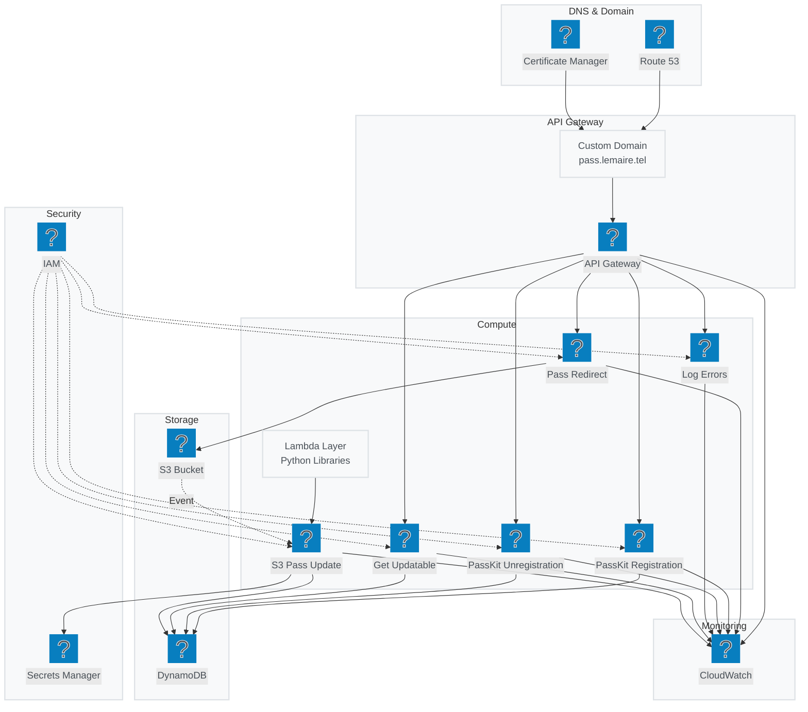

# AWS Infrastructure with Official AWS Icons

## AWS Services with Official Icons

This diagram uses official AWS service icons from the Iconify logos collection:

### Network & DNS
- **logos:aws-route53** - DNS hosting and domain management
- **logos:aws-certificate-manager** - SSL/TLS certificates
- **logos:aws-api-gateway** - HTTP API endpoint management

### Compute
- **logos:aws-lambda** - Serverless compute functions (6 functions)

### Storage & Database
- **logos:aws-s3** - Object storage for pass files
- **logos:aws-dynamodb** - NoSQL database for device registrations

### Security
- **logos:aws-iam** - Identity and access management
- **logos:aws-secrets-manager** - Credential storage

### Monitoring
- **logos:aws-cloudwatch** - Logging and monitoring

### Architecture Benefits
- **Professional Look**: Official AWS service icons
- **Clear Service Identification**: Each icon represents the exact AWS service
- **Proper AWS Colors**: Official AWS color scheme
- **Clean Layout**: Logical grouping by service category